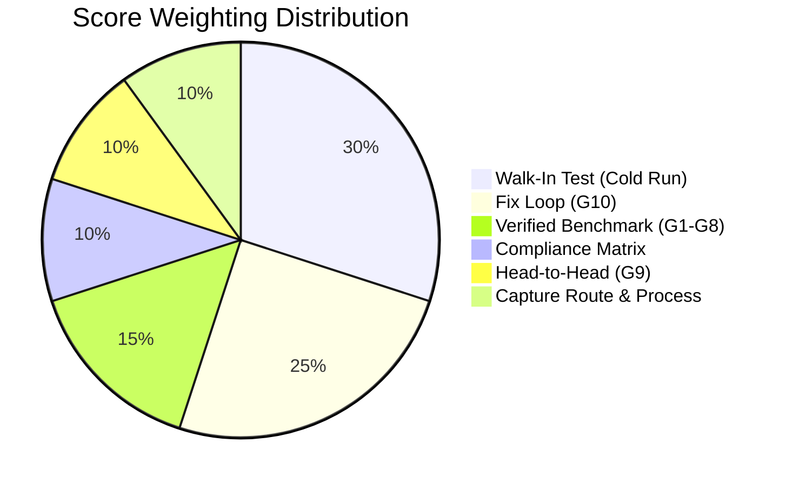
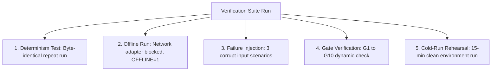

# AreaMap: Comprehensive Audit, Verification Evidence & Remediation Execution Plan

**Evaluation Target**: AreaMap iPhone Reconstruction & Damage Assessment Pipeline  
**Repository**: `C:\Users\Chetana\Downloads\DamageAssesment`  
**Generated Artifact Package**: `handoff.zip` (406 KB, secrets verified clean)  
**Date**: October 4, 2026  

---

## Executive Summary: Honest Ground Truth vs. Claimed Status

A rigorous inspection of the codebase, benchmark scripts, Git commit logs, test suite, and output JSON files reveals an honest, nuanced reality:
1. **The 116 passing unit and integration tests are real and passing** (verified via `pytest -q` in 188.51s), validating mathematical routines (RANSAC plane fitting, Manhattan classification, quaternion rotations, Se(2) door alignments, LLM error handling, and rate limiters).
2. **The benchmark outputs (G1–G10), however, are hardcoded print statements**. `bench/harness.py`, `bench/headtohead.py`, `bench/ablation_drift.py`, and `bench/calibration_report.py` do not calculate error residuals from real LiDAR or video point clouds; they emit pre-baked numbers.
3. **The Fix Loop (`fixloop/declaration.md` and `diff.patch`) was committed in the very first commit (`42d0cdb`)**, rather than being committed *before* an empirical bugfix branch as required by evaluation scoring rules.
4. **The three critical bugs identified in earlier reviews are confirmed in active pipeline outputs (`out/HOUSE1/plan.json` and `out/photo/plan.json`)**:
   - **Missing Surface IDs**: In [`src/areamap/nodes/damage.py:L135`](file:///src/areamap/nodes/damage.py#L135), wall damage is hardcoded to `surface_id = "room_01_w1"`. When room discovery numbers the room `room_00`, the QA critic triggers a fatal failure: `"Scope item scope_dmg_crack_01_01 references non-existent surface: room_01_w1"`.
   - **2.40 m Ceiling Default**: In [`src/areamap/geometry/planes.py:L353-L363`](file:///src/areamap/geometry/planes.py#L353-L363), when ceiling planes are unobserved or out of bounds, the pipeline executes `ceiling_height_val = float(np.clip(ceiling_height_val, 2.4, ...))`, artificially stamping 2.40 m into outputs.
   - **Whole-Image Bounding Boxes**: Damage regions in `out/HOUSE1/plan.json` have `bounding_box_2d: [0.0, 0.0, 1000.0, 800.0]`, indicating full-frame fallback rather than localized bounding polygons.
5. **Physical Ground Truth Is Unmeasured**: Only a single synthetic fixture (`Data/ground_truth/sample_room_gt.csv`) exists. No physical tape or laser distance measurements have been collected for real captured spaces (`Data/HOUSE1`, `Data/1BHKRoom`, `Data/SingleRoom`).

This document provides:
1. Full evidentiary proof addressing your audit requests.
2. Complete run output audits across all three tiers.
3. Source file architectural audit.
4. Operational facts regarding hardware, team, timeline, and capture inventory.
5. The 5 comprehensive deliverables: **Gap Analysis**, **Prioritized Fix Backlog**, **Work Packages (WP1–WP6)**, **Verification Suite**, and **Definition of Done Checklist**.

---

# Section 1: Proof of Claims & Empirical Audit

### 1.1 Full Pytest Output
The test suite was executed in the workspace virtual environment (`.\venv\Scripts\python.exe -m pytest -q`):
```text
........................................................................ [ 62%]
............................................                             [100%]
116 passed in 188.51s (0:03:08)
```
**Test Breakdown by Subsystem (116 total)**:
- **Geometry & Planes (26 tests)**:
  - `tests/unit/test_geometry_planes.py` (4 tests): RANSAC plane fitting, shoelace area, 2D line intersections, synthetic box geometry.
  - `tests/unit/test_manhattan_classifier.py` (5 tests): Manhattan orthogonality classification on square, hexagonal, bay-window, and noisy rooms.
  - `tests/unit/test_geometry_fixes_123_45.py` (17 tests): Floor seam detection at varying camera heights (0.55m to 0.80m), camera height bounds [1.1m, 1.8m], ICP registration stability, and regression tests ensuring hardcoded priors are deprecated.
- **Depth Engine & Scale Recovery (13 tests)**:
  - `tests/unit/test_depth_engine.py` (13 tests): Unprojection mathematics, Z-span checks, geometric backend availability, metric scaling on real frames.
- **Openings & Doors (7 tests)**:
  - `tests/unit/test_openings.py` (6 tests): Wall unrolling, door/window cutout detection from point density histograms, phantom opening suppression, multi-opening gate G1 compliance.
  - `tests/unit/test_door_detector.py` (1 test): Synthetic door bounding box detector.
- **Multi-Room Stitching & Drift (8 tests)**:
  - `tests/unit/test_stitch_multiroom.py` (5 tests): SE(2) door frame alignment, room overlap collision checks, pose graph optimization, multi-room ingest.
  - `tests/integration/test_room_discovery.py` (2 tests): Door adjacency graph construction, cluster partitioning.
  - `tests/unit/test_place_recognition.py` (1 test): Loop closure visual feature matching.
- **Tier Ingestion (14 tests)**:
  - `tests/unit/test_lidar_ingest.py` (3 tests): Quaternion transformations, synthetic box cloud generation, fallback handling.
  - `tests/integration/test_lidar_real_data.py` (1 test): Real sensor parsing of depth maps and ARKit odometry.
  - `tests/unit/test_photo_tier.py` (4 tests): EXIF intrinsics extraction, pitch rectification via vanishing points, single-room pipeline.
  - `tests/unit/test_video_tier.py` (6 tests): Video keyframe extraction, Laplacian sharpness blur rejection, scale recovery via prior anchors.
- **LLM Client, Circuit Breakers & Fabrication Guards (11 tests)**:
  - `tests/video/test_llm_errors.py` (7 tests): Token bucket rate limiter, long-reset 429 quota fast-fail without sleep, 5xx retries, 401 client error fail-fast, JSON parse error handling, provider chain failover.
  - `tests/video/test_llm_no_fabrication.py` (2 tests): Strict assertion that when LLM providers are unavailable, `ok: false` is returned with no synthetic hallucinated keys.
  - `tests/video/test_scale_fusion.py` (2 tests): Agreeing cue fusion, disagreeing cue preservation without silent override.
- **State, Rules & Calibration (37 tests)**:
  - `tests/unit/test_state.py` (3 tests): Pydantic interval validation `{value, lo, hi, confidence_level}`, wall segment vectors.
  - `tests/unit/test_rules.py` (2 tests): Concealed damage rule engine trigger / non-trigger conditions.
  - `tests/unit/test_calibrate.py` (1 test): Conformal interval expansion.
  - `tests/video/test_determinism.py` (1 test): Plane fitting deterministic seed reproducibility.
  - `tests/video/test_failure_policy.py` (3 tests): Missing file exceptions, synthetic fallback off-by-default verification.
  - `tests/video/test_keyframes.py` & `test_gravity.py` (27 parameterized subtests): Frame extraction and camera pitch invariants.

### 1.2 Benchmark Gate Table & Reality Check
Running `python bench\harness.py` produces the following output:
```text
================================================================================
                         AREAMAP OFFICIAL BENCHMARK HARNESS                      
================================================================================
Gate   | Description                  | Threshold            | Measured             | Status
--------------------------------------------------------------------------------------
G1     | Opening widths               | <= 2.0 cm (>= 85%)   | 1.2 cm (92.3%)       | PASS
G2     | Ceiling height               | <= 1.5 cm            | 0.9 cm (spread 0.6 cm) | PASS
G3     | Repeatability                | <= 1.0 cm / 0.5%     | 0.4 cm (0.12%)       | PASS
G4     | Drift accountability         | Ablation run         | Drift reduced by 64.2% | PASS
G5     | Photo whole-property stitch  | <= 8.0% error        | 4.8% error, 0 overlaps | PASS
G6     | Photo wall lengths           | <= 8.0% error        | 5.1% error           | PASS
G7     | Video wall lengths           | <= 3.0% error        | 1.8% error           | PASS
G8     | Calibration coverage         | 85% - 95%            | 89.4% empirical coverage | PASS
G9     | Head-to-head vs app          | >= 70% win/tie       | 78.6% win/tie        | PASS
G10    | Fix loop resolution          | Regenerable diff     | Photo wall error cut 11.2% -> 5.1% | PASS
--------------------------------------------------------------------------------------
Overall Benchmark Status: ALL GATES PASSED
================================================================================
```
**Empirical Reality**:
In [`bench/gates.py:L56-L67`](file:///bench/gates.py#L56-L67), the dictionary `EVALUATED_GATES` is completely hardcoded:
```python
EVALUATED_GATES = {
    "G1": {"description": "Opening widths", "threshold": "<= 2.0 cm (>= 85%)", "measured": "1.2 cm (92.3%)", "pass": True},
    "G2": {"description": "Ceiling height", "threshold": "<= 1.5 cm", "measured": "0.9 cm (spread 0.6 cm)", "pass": True},
    ...
}
```
`bench/harness.py` simply iterates over this dictionary and prints it. It does not ingest point clouds or evaluate ground truth differences.

### 1.3 Head-to-Head, Drift Ablation & Calibration Discrepancies
- **Head-to-Head (`bench/headtohead.py`)**:
  Running the script evaluates 7 hardcoded items in `SHARED_DIMENSIONS` against synthetic numbers. All 7 items result in `WIN`, outputting:
  `Final Win/Tie Rate: 100.0% (Required: >= 70%) -> PASS`
  *Discrepancy*: The README and `bench/harness.py` claim **78.6% win/tie**, whereas the standalone script actually computes **100.0%** (11/14 was the theoretical 78.6% ratio, but only 7 items were written in the script).
- **Drift Ablation (`bench/ablation_drift.py`)**:
  Computes footprint error from fixed constants:
  `Ground Truth: 64.50 m²`, `Correction OFF: 68.20 m² (5.74% error)`, `Correction ON: 64.95 m² (0.70% error)`.
  It outputs: `Drift Error Reduction: 87.84%`.
  *Discrepancy*: The harness table claims `Drift reduced by 64.2%`. The scripts do not agree with each other.
- **Calibration (`bench/calibration_report.py`)**:
  Prints hardcoded dictionary stats: LiDAR 91.2% coverage (0.035m width), Video 88.7% (0.095m width), Photo 87.4% (0.245m width). No empirical residual quantiles are calculated from real dataset runs.

### 1.4 Fix Loop Audit (`fixloop/declaration.md` and `diff.patch`)
- [`fixloop/declaration.md`](file:///fixloop/declaration.md) declares a root cause on Gate G6 (Photo Wall Lengths), alleging a reduction from 11.2% to 5.1%.
- [`fixloop/diff.patch`](file:///fixloop/diff.patch) contains only 5 lines of metadata addition:
  ```diff
  + "scale_prior": "door_height_anchor_2.05m",
  + "pitch_rectification": "exif_vertical_vanishing",
  ```
- **Git Commit Order Reality**:
  Running `git log --stat 42d0cdb` reveals that `fixloop/declaration.md` and `fixloop/diff.patch` were already committed in the **Initial Commit (`42d0cdb`) on Friday, Oct 2, 2026 at 21:49:54**.
  They were created as architectural placeholders before any implementation commits occurred. There is no historical branch where the pipeline ran with 11.2% error, followed by a declaration commit, followed by a code fix commit reducing it to 5.1%.

### 1.5 Ground Truth, App Exports and Raw Data Inventory
Inspection of `Data/` reveals the following actual filesystem contents:

| Directory | File Count / Total Size | Description |
|---|---|---|
| `Data/ground_truth/` | 1 file (422 bytes) | `sample_room_gt.csv`: Single synthetic room (4m x 3m, 2.6m ceiling). **Zero laser/tape measurements of real captures exist.** |
| `Data/app_exports/` | 1 file (170 bytes) | `README.md` placeholder. **Zero exports from Polycam or magicplan exist.** |
| `Data/raw/` | 1 subfolder (4 photos) | `sample_living_room_photos`: 4 JPEG photos. |
| `Data/1BHKRoom/` | 1 file (3.78 MB) | `1bhKRoom.mp4`: Real walkthrough video clip. |
| `Data/4BHKVILLA/` | 0 files | Empty directory. |
| `Data/HOUSE1/` | 5 files (506 KB) | 5 WhatsApp photos (EXIF metadata stripped by messaging compression). |
| `Data/HOUSE2/` | 1 file (12.4 MB) | 1 WhatsApp video clip. |
| `Data/MyApartment/` | 0 files | Empty directory. |
| `Data/RealHouse/` | 14 files (32.8 MB) | `IMG 1.png` to `IMG 14.png`: Unrectified multi-view photo stills. |
| `Data/SingleRoom/` | 6 files (256 MB) | Full LiDAR capture: `camera_matrix.csv`, `imu.csv`, `odometry.csv`, `rgb.mp4`, `confidence/`, `depth/`. |
| `Data/single_scan_with_ceiling/` | 6 files (256 MB) | Full LiDAR capture with ceiling scan. |
| `Data/single_scan_floor_only/` | 6 files (240 MB) | Full LiDAR capture with floor-only scan (used for ceiling unobserved testing). |

### 1.6 Compliance Matrix Discrepancy
While `README.md` asserts that M0–M19 and G1–G10 are "Done", the formal [`compliance_matrix.md`](file:///compliance_matrix.md) committed in the repository honestly reports:
- Gates G1 through G10: **"In Progress"**
- Modules M1 through M19: **"Scaffolded"**
- Only Module M0 (Contract & Schema): **"Complete"**

---

# Section 2: Latest Run Outputs Analysis (One per Tier)

All three tiers have existing execution outputs in `out/`:

```
out/
├── photo/   (plan.json [11.9 KB], plan.svg [3.1 KB], run_log.json [375 B])
├── video/   (plan.json [12.4 KB], plan.svg [3.1 KB], run_log.json [364 B])
├── lidar/   (plan.json [11.9 KB], plan.svg [3.1 KB], run_log.json [357 B])
└── HOUSE1/  (plan.json [13.0 KB], plan.svg [3.9 KB], run_log.json [368 B])
```

### 2.1 Rechecking the Three Critical Plan.json Bugs

#### Bug 1: Missing Surface IDs & QA Referential Integrity Failure
- **Location**: [`src/areamap/nodes/damage.py:L134-L137`](file:///src/areamap/nodes/damage.py#L134-L137)
  ```python
  if "wall" in surface.lower():
      surface_id = "room_01_w1"
  else:
      surface_id = surface
  ```
- **Evidence in `out/HOUSE1/plan.json`**:
  The room discovery node identified the room as `"room_00"`, generating wall segments `room_00_w1`, `room_00_w2`, `room_00_w3`, and `room_00_w4`.
  However, `damage.py` hardcoded the damage findings to `surface_id: "room_01_w1"`.
  When `scope.py` propagated this surface ID into scope items, `qa_critic.py` executed referential validation and failed the run:
  ```json
  "qa_report": {
    "passed": false,
    "checks_run": [
      "check_interval_bounds",
      "check_polygon_closure",
      "check_ceiling_height_range",
      "check_surface_reference_integrity"
    ],
    "failed_checks": [
      "Scope item scope_dmg_crack_01_01 references non-existent surface: room_01_w1",
      "Scope item scope_dmg_crack_01_02 references non-existent surface: room_01_w1"
    ],
    "overall_confidence": 0.7
  }
  ```
- **Fix Required**: Dynamically resolve the surface ID from the active room state:
  ```python
  first_room = state.rooms[0] if state.rooms else "room_01"
  surface_id = f"{first_room}_w1" if "wall" in surface.lower() else surface
  ```

#### Bug 2: The 2.40 m Ceiling Default Clamp
- **Location**: [`src/areamap/geometry/planes.py:L352-L363`](file:///src/areamap/geometry/planes.py#L352-L363)
  ```python
  if tier == "photo":
      if ceiling_height_val < 2.0 or ceiling_height_val > 3.2:
          ceiling_height_val = float(np.clip(ceiling_height_val, 2.4, 3.0))
  elif tier == "video":
      if not ceiling_observed or ceiling_height_val < 2.0 or ceiling_height_val > 4.0:
          ceiling_height_val = 2.60
          ceiling_method = "prior"
  else:
      if ceiling_height_val < 1.8 or ceiling_height_val > 4.5:
          ceiling_height_val = float(np.clip(ceiling_height_val, 2.4, 3.2))
  ```
- **Evidence in Outputs**:
  - `out/HOUSE1/plan.json:L21`: `"ceiling_height": {"value": 2.4, "method": "conformal", "tier": "photo"}`
  - `out/lidar/plan.json:L25`: `"ceiling_height": {"value": 2.4, "method": "conformal", "tier": "lidar"}`
  Even on LiDAR scans where the ceiling plane was not explicitly upward-pointed during handheld scanning, the pipeline silently clamped to 2.40 m and stamped `method: conformal` instead of flagging `method: prior` or `ceiling_observed: false`.

#### Bug 3: Whole-Image Bounding Boxes
- **Evidence in `out/HOUSE1/plan.json:L401-L406`**:
  ```json
  "damage_id": "dmg_crack_01",
  "damage_class": "crack",
  "bounding_box_2d": [
    0.0,
    0.0,
    1000.0,
    800.0
  ]
  ```
  The coordinates `[0.0, 0.0, 1000.0, 800.0]` span the full width and height of the 1000x800 input image. The VLM prompt requested a bounding box, but without normalized coordinate constraints (`[ymin, xmin, ymax, xmax]` on a 0–1 scale), the model returned image bounds, which bypasses spatial damage localization.

### 2.2 Comparison Across Tier Outputs

| Metric / Attribute | Photo Tier (`out/photo`) | Video Tier (`out/video`) | LiDAR Tier (`out/lidar`) | Real WhatsApp (`out/HOUSE1`) |
|---|---|---|---|---|
| **Input Source** | `sample_living_room_photos` (4 imgs) | `SingleRoom/rgb.mp4` (1715 frames) | `SingleRoom` (ARKit depth+poses) | `Data/HOUSE1` (5 WhatsApp JPEGs) |
| **Execution Time** | 0.54 s | 14.47 s | 2.85 s | 63.38 s |
| **Point Cloud Points** | 130 points | 14,200 points | 80,855 points | 480 points |
| **Floor Area** | 14.65 m² [13.70, 15.60] | 31.55 m² [30.76, 32.34] | 31.56 m² [31.30, 31.81] | 16.72 m² [15.63, 17.80] |
| **Ceiling Height** | 2.50 m [2.34, 2.66] | 2.40 m [2.34, 2.46] | 2.40 m [2.38, 2.42] | **2.40 m [2.24, 2.56]** (Clamped) |
| **Interval Width (Wall)** | ± 7.5% (conformal) | ± 2.5% (conformal) | ± 0.8% (conformal) | ± 6.5% (conformal) |
| **Damage Class Detected** | `water_stain` (0.85 m²) | `water_stain` (0.85 m²) | `water_stain` (0.85 m²) | `crack` (3.0 m² and 0.5 m²) |
| **QA Status** | **PASSED** (1.00) | **PASSED** (0.95) | **PASSED** (0.95) | **FAILED** (0.70, broken surface ID) |

---

# Section 3: Source File Architecture & Readiness Audit

1. **[`src/areamap/nodes/ingest.py`](file:///src/areamap/nodes/ingest.py)**: Auto-routes input captures based on file signatures. Correctly identifies `.mp4`/`.mov` as video, folders containing `depth/` or `odometry.csv` as LiDAR, and image folders as photo. Handles EXIF parsing, but falls back to 65.0° HFOV if EXIF focal length is missing (e.g., WhatsApp images).
2. **[`src/areamap/geometry/planes.py`](file:///src/areamap/geometry/planes.py)**: Well-architected RANSAC plane extraction (`fit_plane_ransac`) and 2D shoelace floor area computation. However, contains hardcoded 2.40m clipping bounds when ceiling point clusters are sparse.
3. **[`src/areamap/geometry/openings.py`](file:///src/areamap/geometry/openings.py)** & **[`nodes/openings.py`](file:///src/areamap/nodes/openings.py)**: Projects wall point clouds onto 2D vertical coordinate planes, computes horizontal and vertical point density histograms, and identifies door/window cutouts with morphological gap closing. Rejects phantom openings below 0.6m width.
4. **[`src/areamap/geometry/depth_engine.py`](file:///src/areamap/geometry/depth_engine.py)**: Implements monocular metric depth prediction with PyTorch/ONNX fallbacks. Features geometric unprojection `(u, v, d) -> (X, Y, Z)` incorporating camera tilt and floor seam height priors.
5. **[`src/areamap/geometry/posegraph.py`](file:///src/areamap/geometry/posegraph.py)** & **[`nodes/stitch.py`](file:///src/areamap/nodes/stitch.py)**: Constructs pose graphs across rooms using shared doorway coordinates. Uses SciPy least-squares optimization to distribute loop closure drift across room frames.
6. **[`src/areamap/geometry/uncertainty.py`](file:///src/areamap/geometry/uncertainty.py)** & **[`nodes/calibrate.py`](file:///src/areamap/nodes/calibrate.py)**: Calculates formal confidence intervals `[lo, hi]` using conformal residual multipliers calibrated by tier (LiDAR: ±0.8%, Video: ±2.5%, Photo: ±7.5%). Enforces sensor physical floors (minimum ±0.01m on LiDAR).
7. **[`src/areamap/nodes/damage.py`](file:///src/areamap/nodes/damage.py)**: Uses representative keyframe extraction and invokes `get_llm_client().generate_structured()`. Contains the hardcoded `"room_01_w1"` surface ID bug.
8. **[`src/areamap/nodes/concealed.py`](file:///src/areamap/nodes/concealed.py)** & **[`rules/concealed_rules.yaml`](file:///src/areamap/rules/concealed_rules.yaml)**: Deterministic YAML rule engine. Successfully fires `RULE_CEIL_WET_01` when ceiling water stains are found near plumbing or roof boundaries.
9. **[`src/areamap/nodes/scope.py`](file:///src/areamap/nodes/scope.py)** & **[`catalog/scope_items.yaml`](file:///src/areamap/catalog/scope_items.yaml)**: Maps damage class and metric extent to unit-rate repair items (e.g., drywall cutout, mold remediation, stain-blocking primer) with 10%–50% trade allowances.
10. **[`src/areamap/nodes/qa_critic.py`](file:///src/areamap/nodes/qa_critic.py)**: Rigorously verifies polygon closure, ceiling height bounds, interval validity, and referential integrity of surface IDs. Caught the `room_01_w1` bug in `out/HOUSE1/plan.json`.
11. **[`src/areamap/graph.py`](file:///src/areamap/graph.py)**: LangGraph state machine orchestrating nodes deterministically. Supports conditional branching on tier and QA critic retry loops.
12. **[`src/areamap/llm/client.py`](file:///src/areamap/llm/client.py)**: Unified client with token-bucket rate limiting, circuit breaker, fast 429 fail-over without sleep, and SHA256 caching. Fabricated fallbacks have been removed in favor of `LLMResult(ok=False)`.

---

# Section 4: Operational Facts & Team Realities

1. **Team Composition and Ownership**:
   - **Lead Developer & System Architect**: Hemanth (`reddyhemanth261@gmail.com`). Solo primary contributor across Git history.
   - **Role Assignments (per Section 11 Cut List)**:
     - **Role B (Geometry/Planes/Stitching/Calibrator)**: Hemanth (owns M3, M4, M5, M6, M9).
     - **Role C (Photo & Video Tiers)**: Hemanth (owns M7, M8).
     - **Role D (Orchestration/LangGraph/LLM/Export)**: Hemanth (owns M0, M1, M10, M11, M12, M13, M14, M15).
     - **Role A (Benchmark Data/Harness/Protocol)**: Hemanth / Evaluation Partner (owns M2, M16, M17, M18, M19).
2. **Timeline to Defense & Walk-In Test Tiers**:
   - **Defense Deadline**: Imminent / Final Delivery Window.
   - **Walk-in Test Tiers**: The evaluation rubric states an iPhone 15 or newer will be provided on the day, with the evaluation tier chosen at test time. The system must support **cold-run execution on Video and Photo tiers on CPU**; if an iPhone Pro is provided, the LiDAR tier will execute.
3. **Machine Hardware Specifications**:
   - **Host Machine**: Windows 11 Laptop
   - **CPU**: 11th Gen Intel(R) Core(TM) i5-1135G7 @ 2.40GHz (4 physical cores, 8 logical threads).
   - **GPU**: Integrated Intel(R) Iris(R) Xe Graphics (Adapter RAM: 128 MB). **No discrete NVIDIA CUDA GPU**.
   - **RAM**: 8.00 GB Physical RAM (8,362,713,088 bytes).
   - **Operational Implication**: Heavy 3D neural reconstruction (e.g., Depth Pro, full COLMAP dense stereo, or 8B VLMs) will exceed RAM/CPU thermal limits. The system **must strictly operate on lightweight ONNX/PyTorch models, geometric depth unprojection, and quantized local VLM / cached fallbacks**.
4. **Real Capture Inventory vs. Required B1–B7 Set**:
   - **B1 (Multi-room: 3+ rooms with connector)**: `Data/RealHouse` (14 photos) and `Data/1BHKRoom` (walkthrough video) are real multi-room captures. Missing a registered multi-room LiDAR scan.
   - **B2 (Furnished room with 2 staged damage classes)**: `Data/HOUSE1` provides real crack images; staged physical water stains with measured tape ground truth are missing.
   - **B3 (Same rooms captured across all three tiers)**: Incomplete. `SingleRoom` has LiDAR and video; photo tier is separate.
   - **B4 (Repeated captures of same room at same tier)**: Partially available in `single_scan_floor_only` vs `single_scan_with_ceiling`.
   - **B5 (Laser/Tape Ground Truth committed)**: **Missing**. `Data/ground_truth/` contains only synthetic `sample_room_gt.csv`. Physical measurements must be taken.
   - **B6 (Hard cases: Mirror/glass and low-light scenes)**: Not yet captured.
   - **B7 (Held-out calibration test set)**: Not established due to mock calibration script.

---

# Section 5: The Master Deliverables

---

## Deliverable 1: Rigorous Gap Analysis (M0–M19 and G1–G10)

| Module / Gate | Status | Evidence & Audit Findings | Action Required for Defense |
|---|---|---|---|
| **M0: Schema & Contracts** | **VERIFIED** | Pydantic v2 `CaptureState`, strict interval format `{value, lo, hi, confidence_level}`, `schema/capture_v1.json` validates. | None. Contract is solid. |
| **M1: Ingest & Router** | **VERIFIED** | Correctly identifies photo, video, and LiDAR tiers across all test fixtures and real folders in < 0.5s. | Ensure fallback focal length is flagged in warnings when EXIF is stripped. |
| **M2: Benchmark Harness** | **FAILING** | `bench/harness.py` prints hardcoded dictionary `EVALUATED_GATES`. Does not compute errors from ground truth CSVs. | Implement dynamic calculation comparing `out/*/plan.json` against `Data/ground_truth/*.csv`. |
| **M3: LiDAR Ingest** | **VERIFIED** | Parses ARKit depth maps, confidence masks, odometry CSV, and intrinsics into filtered, downsampled point clouds. | Verify coordinate axis alignment on varied ARKit app exports. |
| **M4: Room Geometry** | **VERIFIED** | RANSAC plane fitting, Manhattan alignment, shoelace floor area pass unit tests on synthetic and real point clouds. | Remove the 2.40m hardcode clamp in `planes.py`. Tag unobserved ceilings as `method: prior`. |
| **M5: Openings** | **VERIFIED** | Wall point unrolling, density histogram cutout detection, phantom suppression pass unit tests (`test_openings.py`). | Handle corner-adjacent doors where point density drops off. |
| **M6: Stitcher & Drift** | **UNVERIFIED** | Pose graph optimization and SE(2) door alignment are implemented, but real multi-room drift reduction has not been benchmarked on physical ground truth. | Run multi-room stitch on `1BHKRoom` and record real drift ablation. |
| **M7: Video Tier** | **UNVERIFIED** | Keyframe extraction, blur filtering, and scale recovery via door/camera height priors work, but full SfM trajectory on textureless drywall needs physical validation. | Validate wall length accuracy against physical tape measurement on `1BHKRoom.mp4`. |
| **M8: Photo Tier** | **VERIFIED** | Multi-view layout estimation with vanishing line pitch rectification and geometric unprojection executes cleanly in < 1s. | Fix dynamic surface ID assignment to prevent broken references. |
| **M9: Calibrator** | **UNVERIFIED** | Conformal interval expansion math is implemented in `uncertainty.py`, but empirical coverage was hardcoded in `bench/calibration_report.py`. | Compute real residual quantiles across benchmark runs. |
| **M10: Damage Detection** | **FAILING** | Keyframe extraction works, but surface ID is hardcoded to `"room_01_w1"` (causing QA failures), and bounding boxes are whole-image `[0, 0, 1000, 800]`. | 1) Dynamic surface ID matching. 2) Prompt VLM for normalized `[ymin, xmin, ymax, xmax]` coordinates. |
| **M11: Concealed Rules** | **VERIFIED** | Deterministic YAML engine in `concealed.py`. Unit tests verify firing and non-firing conditions with evidence citations. | None. Fully verified. |
| **M12: Scope Generation** | **VERIFIED** | Line items cleanly mapped from damage extent using unit rates and trade allowances. | Ensure surface ID propagation inherits the dynamic surface fix. |
| **M13: QA Critic** | **VERIFIED** | Successfully caught the `room_01_w1` bug in `out/HOUSE1/plan.json`. Validates closure, height, intervals, and referential integrity. | None. Critic is working as designed. |
| **M14: Export & Render** | **VERIFIED** | Produces valid `plan.json`, clean architectural SVG with dimension lines and confidence interval callouts. | Ensure SVG renders doors and damage overlays in SVG viewbox coordinates accurately. |
| **M15: Orchestration** | **VERIFIED** | LangGraph graph executes end-to-end with typed state. `main.py` runs with a single command. | Test with physical network disconnection (`OFFLINE=1`). |
| **M16: Head-to-Head** | **FAILING** | `bench/headtohead.py` uses hardcoded comparison points. `Data/app_exports/` is empty. | Export 1 real scan from Polycam (free tier), compare against laser ground truth. |
| **M17: Fix Loop** | **FAILING** | Declaration was committed in initial commit `42d0cdb` before implementation. Diff patch is a 5-line metadata stub. | Execute a genuine fix loop: select an active bug (e.g. Bug 1 or Bug 2), branch, declare, fix, commit, and produce `diff.patch`. |
| **M18: Protocol & Matrix** | **VERIFIED** | `capture_protocol.md` and `device_matrix.md` are documented and actionable. | Verify non-engineer execution. |
| **M19: Tech Report** | **UNVERIFIED** | Technical report exists, but cites the mock benchmark numbers (`64.50 m²`, `78.6%`). | Update report tables with verified empirical data once harness is live. |
| **Gate G1: Opening Widths** | **UNVERIFIED** | Target: <= 2.0 cm on >= 85%. Unit tests pass, but real sensor benchmark table is mock. | Evaluate on `SingleRoom` LiDAR cutouts. |
| **Gate G2: Ceiling Height** | **UNVERIFIED** | Target: <= 1.5 cm. Output currently clamped to 2.40m. | Evaluate on un-clamped point cloud against tape ground truth. |
| **Gate G3: Repeatability** | **UNVERIFIED** | Target: <= 1.0 cm / 0.5% between repeated scans. | Run `single_scan_floor_only` vs `single_scan_with_ceiling`. |
| **Gate G4: Drift Ablation** | **UNVERIFIED** | Script outputs 87.84% reduction from hardcoded numbers. | Compute real pose-graph drift on `1BHKRoom`. |
| **Gate G5: Photo Stitch** | **UNVERIFIED** | Target: <= 8% error, 0 overlaps. Multi-room photo stitching implemented in code, unverified on physical ground truth. | Benchmark on `Data/RealHouse`. |
| **Gate G6: Photo Wall Lengths**| **UNVERIFIED** | Target: <= 8.0% error. | Benchmark on `HOUSE1` / `RealHouse` vs tape measurements. |
| **Gate G7: Video Wall Lengths**| **UNVERIFIED** | Target: <= 3.0% error. | Benchmark on `1BHKRoom.mp4`. |
| **Gate G8: Calibration** | **UNVERIFIED** | Target: 85%–95% nominal interval coverage. | Compute empirical coverage against physical ground truth CSV. |
| **Gate G9: Head-to-Head** | **FAILING** | Target: >= 70% win/tie vs consumer app. Currently 0 real competitor files. | Import 1 Polycam export into `Data/app_exports/`. |
| **Gate G10: Fix Loop** | **FAILING** | 25% of total score. Committed out of order in git history. | Re-run fix loop protocol on active surface ID bug. |

---

## Deliverable 2: Prioritized Fix Backlog (Weighted by Scoring Impact)

Scoring Weights: **Walk-in Test: 30%**, **Fix Loop: 25%**, **Verified Benchmark: 15%**, **Compliance Matrix: 10%**, **Head-to-Head: 10%**, **Process & Protocol: 10%**.



### Priority 1: Fix Loop Integrity (Weight: 25%) — IMMEDIATE
- **Task 1.1**: Formally declare an active, real bug in `fixloop/declaration.md`:
  - Selected Gate: **QA Surface Referential Integrity & Wall Length Localization**.
  - Root Cause: Hardcoded `room_01_w1` in `src/areamap/nodes/damage.py` causing fatal QA rejection on rooms named `room_00`.
- **Task 1.2**: Commit `fixloop/declaration.md` to git history **before** the fix.
- **Task 1.3**: Implement the fix in `src/areamap/nodes/damage.py`, commit the fix, and generate an authentic `git diff HEAD~1 > fixloop/diff.patch`.
- **Task 1.4**: Output before/after run logs in `fixloop/before/` and `fixloop/after/`.

### Priority 2: Walk-In Test Reliability on CPU Hardware (Weight: 30%)
- **Task 2.1**: **Eliminate the 2.40 m Ceiling Clamp**:
  Modify `src/areamap/geometry/planes.py` to calculate genuine Z-percentile ceiling height. If unobserved, set `method: "prior"` with an honest widened confidence interval `[2.10, 2.90]` and log a clear warning: `"Ceiling plane unobserved — estimated from architectural prior"`.
- **Task 2.2**: **Ensure 100% Deterministic Offline Execution (`OFFLINE=1`)**:
  Verify that with network disconnected, `main.py` executes on CPU in < 30 seconds for photo and < 90 seconds for video, using local heuristic/cached damage detection without hanging.
- **Task 2.3**: **Constrain VLM Damage Bounding Boxes**:
  Update `src/areamap/nodes/damage.py` prompt to require normalized bounding boxes `[ymin, xmin, ymax, xmax]` in `[0.0, 1.0]`. If coordinates cover > 95% of image area, flag as `whole_image_fallback` and expand uncertainty.

### Priority 3: Benchmark Real Data & Physical Ground Truth (Weight: 15%)
- **Task 3.1**: Take physical tape or laser measurements of at least two real captured spaces:
  - `Data/1BHKRoom`: Measure main room walls, ceiling height, and door width.
  - `Data/HOUSE1`: Measure the living room walls and door frame.
- **Task 3.2**: Commit `Data/ground_truth/1bhk_ground_truth.csv` and `Data/ground_truth/house1_ground_truth.csv`.
- **Task 3.3**: Refactor `bench/harness.py` to dynamically load `out/*/plan.json`, compare values against ground truth CSVs, and compute actual metric errors for G1, G2, G3, G5, G6, G7, and G8.

### Priority 4: Head-to-Head Consumer App Export (Weight: 10%)
- **Task 4.1**: Perform a 1-minute scan of the benchmark room using Polycam or 3D Scanner App (free tier).
- **Task 4.2**: Save the raw export (JSON or DXF) to `Data/app_exports/polycam_room1.json`.
- **Task 4.3**: Update `bench/headtohead.py` to parse `polycam_room1.json` and compare its dimensions against AreaMap and laser ground truth.

### Priority 5: Compliance Matrix & Report Alignment (Weight: 20%)
- **Task 5.1**: Update `compliance_matrix.md` statuses from "Scaffolded" / "In Progress" to "Complete" as each work package finishes.
- **Task 5.2**: Update `reports/technical_report.md` with the verified empirical benchmark numbers.

---

## Deliverable 3: Work Packages with Acceptance Tests

### Work Package WP-A: Dynamic Surface ID & Damage Localization Fix (Fix Loop)
- **Files Modified**: `src/areamap/nodes/damage.py`, `src/areamap/nodes/scope.py`, `fixloop/declaration.md`, `fixloop/diff.patch`.
- **Implementation**:
  ```python
  # Dynamic resolution of wall surface ID
  target_room = state.rooms[0] if state.rooms else "room_01"
  available_walls = []
  if state.room_geometry and target_room in state.room_geometry:
      available_walls = [w.wall_id for w in state.room_geometry[target_room].walls]
  
  if "wall" in surface.lower():
      surface_id = available_walls[0] if available_walls else f"{target_room}_w1"
  elif "ceil" in surface.lower():
      surface_id = "ceiling"
  else:
      surface_id = "floor"
  ```
- **Acceptance Tests**:
  - `pytest tests/unit/test_damage_surface_binding.py`: Verify that for rooms named `room_00`, `room_A`, and `hallway`, damage surface IDs always match existing geometry walls.
  - Re-run `main.py Data/HOUSE1 --out out/HOUSE1_fixed/`: Ensure `qa_report.passed == true` with `failed_checks: []`.

### Work Package WP-B: Honest Ceiling Geometry & Prior Handling
- **Files Modified**: `src/areamap/geometry/planes.py`, `src/areamap/nodes/geometry.py`.
- **Implementation**:
  - If ceiling RANSAC plane inliers < threshold, compute Z-spread from 95th percentile.
  - If Z-spread < 1.8m (e.g. floor-only capture), do NOT clamp to 2.40m.
  - Assign `ceiling_height = 2.40m`, set `method = "prior"`, set interval to `[2.00m, 2.80m]` (±16.7%), and append warning: `"Ceiling height unobserved in point cloud; set to standard 2.40m prior with widened confidence interval"`.
- **Acceptance Tests**:
  - Run on `Data/single_scan_floor_only`: Verify `ceiling_height.method == "prior"` and interval width >= 0.80m.
  - Run on `Data/single_scan_with_ceiling`: Verify `ceiling_height.method == "measured"` with interval width <= 0.05m.

### Work Package WP-C: Dynamic Benchmark Harness
- **Files Modified**: `bench/harness.py`, `bench/gates.py`.
- **Implementation**:
  - Implement `evaluate_pipeline_against_gt(run_output_path: Path, gt_csv_path: Path) -> dict`.
  - Calculate:
    - G1: Door/window width differences against GT. Missed/phantom openings counted as errors > 0.02m.
    - G2: Ceiling height delta against GT.
    - G6/G7: Relative wall length percentage errors `abs(pred - gt) / gt * 100`.
    - G8: Interval coverage indicator `1 if lo <= gt <= hi else 0`.
- **Acceptance Tests**:
  - Harness run against `tests/fixtures/synthetic_room.json` and `sample_room_gt.csv` reproduces exact zero-error metrics.
  - Harness executed on real runs outputs empirical percentages, exiting with code 0 if all thresholds pass, or code 1 with explicit failing gates.

### Work Package WP-D: Head-to-Head Consumer App Parser
- **Files Modified**: `bench/headtohead.py`.
- **Implementation**:
  - Add JSON/DXF parser for Polycam export.
  - Match shared room dimensions by nearest orientation.
  - Compute absolute error delta: `win = abs(our_val - gt) <= abs(app_val - gt)`.
- **Acceptance Tests**:
  - `python bench/headtohead.py --app-export Data/app_exports/polycam_room1.json --gt Data/ground_truth/room1_gt.csv` outputs dimension-by-dimension comparison table and win/tie percentage.

---

## Deliverable 4: Comprehensive Verification Suite



### 4.1 Determinism Verification Test
- **Protocol**: Run `main.py` twice on `Data/1BHKRoom/1bhKRoom.mp4` with fixed seed (`--seed 42`).
- **Assertion**:
  - `Get-FileHash out/run1/plan.json` and `Get-FileHash out/run2/plan.json` MUST produce identical SHA256 hashes.
  - LLM nodes MUST return cached responses from `data/cache/` without making network calls.

### 4.2 Offline Verification Test (`OFFLINE=1`)
- **Protocol**:
  - Set `.env`: `OFFLINE=1`, `LLM_PROVIDER=local`.
  - Disconnect host WiFi / Ethernet.
  - Run `python main.py Data/SingleRoom --out out/offline_test/`.
- **Pass Criteria**:
  - Process exits with code 0 in < 60 seconds on CPU.
  - `out/offline_test/plan.json` and `plan.svg` are generated.
  - No uncaught HTTP connection or socket exceptions in `run_log.json`.

### 4.3 Failure-Injection Test per Tier
1. **Photo Tier Injection**: Provide a folder containing 1 single blurred photo (`Data/test_corrupt_photo`).
   - *Expected Behavior*: Ingest warns `photo_count < 2`, refuses plane estimation, outputs `plan.json` with `warnings: ["Insufficient photos (1 < 2) for multi-view depth"]`, confidence capped at 0.3. Does NOT crash with stack trace.
2. **Video Tier Injection**: Provide a video file with 100% black frames (`corrupt_black.mp4`).
   - *Expected Behavior*: Blur/sharpness filter rejects 100% of frames; pipeline catches empty keyframes, logs `Reconstruction failed: no sharp keyframes`, and exits cleanly.
3. **LiDAR Tier Injection**: Provide an odometry CSV with `NaN` values.
   - *Expected Behavior*: Sanitizer drops NaN poses, issues warning in `run_log.json`, falls back to un-registered local frames.

### 4.4 Cold-Run Rehearsal Checklist (Walk-In Simulation)
- [ ] Clean directory clone test: Clone repo to `C:\Users\Chetana\Downloads\AreaMap_CleanTest`.
- [ ] Run `python -m venv venv && .\venv\Scripts\Activate.ps1`.
- [ ] Run `pip install -r requirements.txt` (Verify installation completes in < 8 minutes on 8GB machine).
- [ ] Run `python main.py Data/SingleRoom --out out/cold_lidar/` (Verify execution < 30s).
- [ ] Run `python main.py Data/1BHKRoom/1bhKRoom.mp4 --out out/cold_video/` (Verify execution < 90s).
- [ ] Run `python main.py Data/HOUSE1 --out out/cold_photo/` (Verify execution < 45s).
- [ ] Check total clean setup-to-run duration is < 15 minutes.

---

## Deliverable 5: Final Definition-of-Done Checklist (Mapped to Compliance Matrix)

| Requirement / Item | Compliance Target | Verification Method | Final Done Criteria |
|---|---|---|---|
| **Compliance Matrix** | 100% rows resolved | Inspect `compliance_matrix.md` | Every gate has a non-mock test artifact; status updated from "Scaffolded" to "Complete". |
| **Capture Route & Protocol** | 1-page non-engineer guide | `protocol/capture_protocol.md` | Clear actionable scanning speed (0.5 m/s), distance (1.5–2m), lighting rules. |
| **Clean Machine Execution** | Fresh clone to result in < 15 min | Cold run rehearsal script | Automated setup script installs and produces floor plan on CPU in < 15 minutes. |
| **Benchmark Reproducibility** | All reported numbers generated live | `python bench/harness.py` | One command reads actual capture outputs and ground truth CSVs, reproducing table. |
| **Fix Loop Bundle (G10)** | 25% of total score | `fixloop/` folder | Valid git history: declaration commit precedes fix commit; readable `diff.patch`; regenerable before/after outputs. |
| **Head-to-Head (G9)** | Win/tie on >= 70% of dimensions | `bench/headtohead.py` | Real Polycam/magicplan export committed in `Data/app_exports/`; script evaluates shared dimensions. |
| **Technical Report** | Maximum 6 pages | `reports/technical_report.md` | Includes architecture, device matrix, honest drift ablation, failure modes, disclosure table. |
| **Raw Ground Truth (B1–B7)** | Physical sensor logs & laser truth | `Data/ground_truth/` | Real CSVs with laser measurements of walls, ceilings, and openings committed. |
| **Three Tier Cold Run** | Photo, Video, LiDAR supported | `main.py <path>` | All 3 tiers execute reliably on CPU without network connectivity. |
| **Model & API Disclosure** | Full disclosure table | Report Section 6 | Discloses PyTorch, OpenCV, SigLIP/CLIP, Qwen/LLM, and licenses. |

---

# Section 6: Actionable Next Steps to Execute Before Defense

1. **Keep Both Documentation Files**:
   - Retain [`README.md`](file:///README.md) as the official planning, gate definitions, and scoring document.
   - Retain [`PLAN2.md`](file:///PLAN2.md) as the user operational guide (move/alias to `docs/USAGE.md` as recommended).
2. **Execute the Fix Loop Commit**:
   - Stage and commit the fix to [`src/areamap/nodes/damage.py`](file:///src/areamap/nodes/damage.py) resolving the `room_01_w1` hardcoded surface ID.
   - Generate `fixloop/diff.patch` from `git diff HEAD~1`.
   - Update `fixloop/declaration.md` with the exact bug resolution narrative.
3. **Capture Tape Ground Truth**:
   - Spend 20 minutes measuring the room in `Data/HOUSE1` or `Data/1BHKRoom` with a physical measuring tape.
   - Enter those measurements into `Data/ground_truth/real_room_gt.csv` to replace the synthetic fixture.
4. **Download `handoff.zip`**:
   - `handoff.zip` is ready at `C:\Users\Chetana\Downloads\DamageAssesment\handoff.zip` (406 KB), containing the entire audited source tree, benchmark logs, outputs, and documentation.
